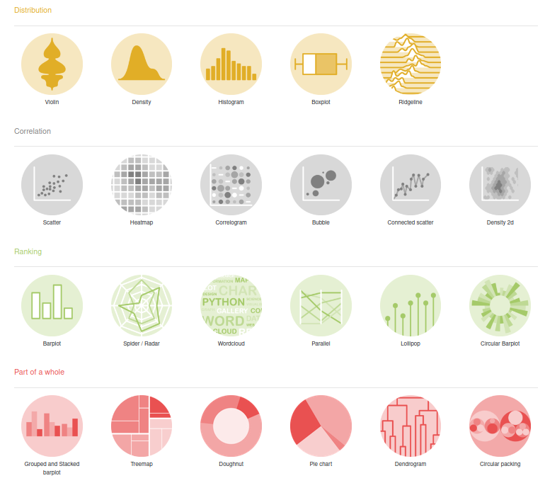

```{r setup, include=FALSE}
options(htmltools.dir.version = FALSE)
knitr::opts_chunk$set(fig.retina = 3, message = FALSE) #rendering sharp plots / not showing messages
```

```{r xaringan-themer, include=FALSE, warning =FALSE}
library(xaringanthemer)
style_mono_light(base_color = "#081c15")
library(tidyverse)
library(palmerpenguins)
library(viridis)
```

# Why ggplot(2)?


### - Beautiful plots
  
--

### - Part of the tidyverse
  
--

### - Readability & re-usability

--

### - Documentation

---
# Plot example
.pull-left[
```{r, plot_plot,fig.height=5, warning =FALSE}
plot(penguins$bill_length_mm,
     penguins$bill_depth_mm)
```
]
.pull-right[
```{r, plot_ggplot, fig.height=4, warning =FALSE}
ggplot(penguins) +
  aes(x=bill_length_mm, 
      y=bill_depth_mm) +
  geom_point() 
```
]
---
# What did we just plot?


---
# How does ggplot work ?

.pull-left[
```{r, fig.height=4, warning =FALSE}
ggplot(penguins) +        #<<
  aes(x=bill_length_mm, 
      y=bill_depth_mm) +
  geom_point()
```
]
.pull-right[
1. **Data** 

  - Provide ggplot with a dataframe
]

---
# How does ggplot work ?
.pull-left[
```{r, fig.height=4, warning =FALSE}
ggplot(penguins) +      
  aes(x=bill_length_mm,  #<<
      y=bill_depth_mm) + #<<
  geom_point()
```
]

.pull-right[
1.  Data 

  - Provide ggplot with a dataframe

2. **Aesthetics ("aes")**
  
  - Tell ggplot how to style the data
  
  - e.g. what belongs on the x and y axis or how to points
]
---

# How does ggplot work ?
.pull-left[
```{r, fig.height=4, warning =FALSE}
ggplot(penguins) +      
  aes(x=bill_length_mm, 
      y=bill_depth_mm) +
  geom_point()           #<<
```
]

.pull-right[
1.  Data 

  - Provide ggplot with a dataframe

2. Aesthetics ("aes")
  
  - Tell ggplot how to style the data
  
  - e.g. what belongs on the x and y axis or how to points

3. **Geometries ("geoms")**
      
  - Tell ggplot the geometrical form to be used
      
  - e.g.: line, point, bar, box, ...
]

---
# Whats the matter with geom?
.pull-left[
```{r, fig.height=4, warning =FALSE}
ggplot(penguins) +
  aes(x=bill_length_mm, 
      y=bill_depth_mm) +
  geom_point() +
  geom_smooth(method="lm") #<<
```
]
.pull-right[
- We can easily add another representation of the same data
- In this case the best linear approximation of the data
- But wait why is the slope negative?
]

---
# Whats the matter with aes?
.pull-left[
```{r, fig.height=4, warning =FALSE}
ggplot(penguins) +
  aes(x=bill_length_mm, 
      y=bill_depth_mm,
      color=species) + #<<
  geom_point() +
  geom_smooth(method="lm")
```
]
.pull-right[
- We can easily add another aesthetic
- In this case color each species in a different color
- Now the slopes are positive
- A nice example of Simpsons paradox
]

---
# Example:
### Plot distribution of bill length per islands:

.pull-left[
Let's start with a box plot
```{r, example_1,fig.show = 'hide', warning =FALSE}
ggplot(penguins) +
  aes(y=bill_length_mm, x=island) +
  geom_boxplot()  #<<
```
]
.pull-right[
```{r ref.label = 'example_1', echo = FALSE, fig.height=5, warning =FALSE}
```
]
---
# Example:
A boxplot may hide information which can be made accessible with jitter
.pull-left[
```{r, example_2,fig.show = 'hide', warning =FALSE}
ggplot(penguins) +
  aes(y=bill_length_mm, x=island) +
  geom_boxplot() +
  geom_jitter()   #<<
```
]
.pull-right[
```{r ref.label = 'example_2', echo = FALSE,fig.height=5, warning =FALSE}
```
]
---
# Example:
Another possibility is a violin plot (works best with lots of data)
.pull-left[
```{r, example_3,fig.show = 'hide', warning =FALSE}
ggplot(penguins) +
  aes(y=bill_length_mm, x=island) +
  # geom_boxplot() +
  geom_violin(fill=NA) + #<<
  geom_jitter()
```
]
.pull-right[
```{r ref.label = 'example_3',fig.height=5, echo = FALSE, warning =FALSE}
```
]
---
# Example:
Combining violin with boxplot is a powerful option
.pull-left[
```{r, example_4, fig.show = 'hide',warning =FALSE}
ggplot(penguins) +
  aes(y=bill_length_mm, x=island) +
  geom_violin() +
  # geom_jitter()
  geom_boxplot(width=0.2)       #<<
```
]
.pull-right[
```{r ref.label = 'example_4',fig.height=5, echo = FALSE, warning =FALSE}
```
]
---
# Example:
Let's add title, labels, and a theme
.pull-left[
```{r, example_5, fig.show = 'hide',warning =FALSE}
ggplot(penguins) +
  aes(y=bill_length_mm, x=island) +
  geom_violin() +
  geom_boxplot(width=0.2, 
               alpha=0.2, #<<
               color = "white") + #<<
  labs(title = "Bill length distribution", #<<
       x = "Island", #<<
       y = "Bill Length (mm)") + #<<
  theme_xaringan() #<<
```
]
.pull-right[
```{r ref.label = 'example_5',fig.height=5, echo = FALSE, warning =FALSE}
```
]
---
# Example:
Let's distinguish between species
.pull-left[
```{r, example_6,fig.show = 'hide', warning =FALSE}
ggplot(penguins) +
  aes(y=bill_length_mm, x=island, 
      color=species) + #<<
  geom_violin(width=0.75, alpha=0.7) + #<<
  geom_boxplot(alpha=0.2) + #<<
  labs(title = "Bill length distribution",
       x = "Island",
       y = "Bill Length (mm)")
```
]
.pull-right[
```{r ref.label = 'example_6',fig.height=5, echo = FALSE, warning =FALSE}
```
]
---
# Example:
And change colors to the viridis scale (optimized for colorblind, and grayscale printing)
.pull-left[
```{r, example_7, fig.show = 'hide',warning =FALSE}
ggplot(penguins) +
  aes(y=bill_length_mm, x=island, 
      color=species) +
  geom_violin(width=0.75, alpha=0.7) +
  geom_boxplot(alpha=0.2) + 
  labs(title = "Bill length distribution",
       x = "Island",
       y = "Bill Length (mm)") +
  scale_color_viridis(discrete = TRUE)  #<<
```
]
.pull-right[
```{r ref.label = 'example_7',fig.height=5, echo = FALSE, warning =FALSE}
```
]
---
# Example:
Rename the legend
.pull-left[
```{r, example_8,fig.show = 'hide', warning =FALSE}
ggplot(penguins) +
  aes(y=bill_length_mm, x=island,
      color=species) +
  geom_violin(width=0.75, alpha=0.7) + 
  geom_boxplot(alpha=0.2) + 
  labs(title = "Bill length distribution",
       x = "Island",
       y = "Bill Length (mm)",
       color = "Species") + #<<
  scale_color_viridis(discrete = TRUE)
```
]
.pull-right[
```{r ref.label = 'example_8',fig.height=5, echo = FALSE, warning =FALSE}
```
]
---
# Example:
Use the power of faceting
.pull-left[
```{r, example_9, fig.show = 'hide', warning=FALSE}
ggplot(penguins) +
  aes(y=bill_length_mm, x=species, #<<
      color=species) + #<<
  facet_grid(cols = vars(island)) + #<<
  geom_violin(width=0.75, alpha=0.7) + 
  geom_boxplot(width=0.3, alpha=0.2) + #<<
  labs(title = "Bill length distribution",
       x = "Island",
       y = "Bill Length (mm)",
       color = "Species") +
  scale_color_viridis(discrete = TRUE)
```
]
.pull-right[
```{r ref.label = 'example_9',fig.height=5, echo = FALSE, warning =FALSE}
```
]
---
# Example:
And save the plot as .png with ggsave. 
.pull-left[
```{r, example_10, fig.show = 'hide', warning =FALSE}
ggplot(penguins) +
  aes(y=bill_length_mm, x=species, 
      color=species) +
  facet_grid(cols = vars(island)) +
  geom_violin(width=0.75, alpha=0.7) + 
  geom_boxplot(width=0.3, alpha=0.2) + 
  labs(title = "Bill length distribution",
       x = "Island",
       y = "Bill Length (mm)",
       color = "Species") +
  scale_color_viridis(discrete = TRUE) 
ggsave("our_first_plot.png")
```
]
.pull-right[
```{r ref.label = 'example_10',fig.height=5, echo = FALSE, warning =FALSE}
```
ggsave() can save plots as:  "eps", "ps", "tex" (pictex), "pdf", "jpeg", "tiff", "png", "bmp", "svg" or "wmf" (windows only).
]
---

# There are many, many ways to represent data
.pull-left[

]
.pull-right[
1.  Ridgline

2.  Histogram

3.  Spider plot

4.  Treemap

5.  Bubble
        
6. etc. ...
]

---
# Helpful resources

  - **The Documaentation:** 
  
  <https://ggplot2.tidyverse.org/index.html>
  
  - **R Cheatsheets (ggplot2):**
  
  <https://github.com/rstudio/cheatsheets/blob/master/data-visualization-2.1.pdf>

  - **Extensive intro to ggplot:** The R-Graphics Cookbook: 
  
  <https://r-graphics.org/>

  - **Concise intro to ggplot:** The *Graphics for Communication* chapter from R4DS:
  
  <https://r4ds.had.co.nz/graphics-for-communication.html>

  - **Inspiration:** The R Graph Gallery:
  
  <https://www.r-graph-gallery.com/>
  
---
# Questions?